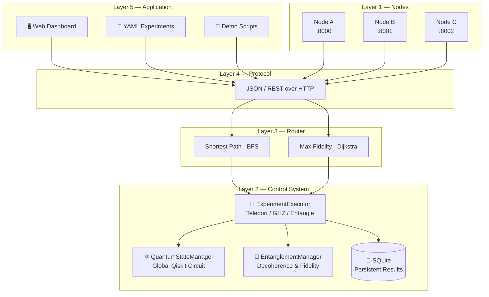
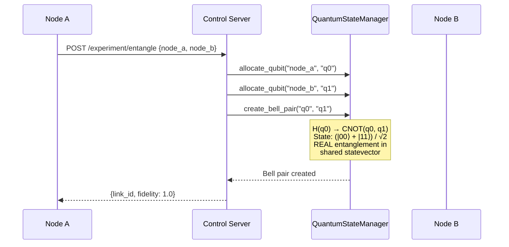
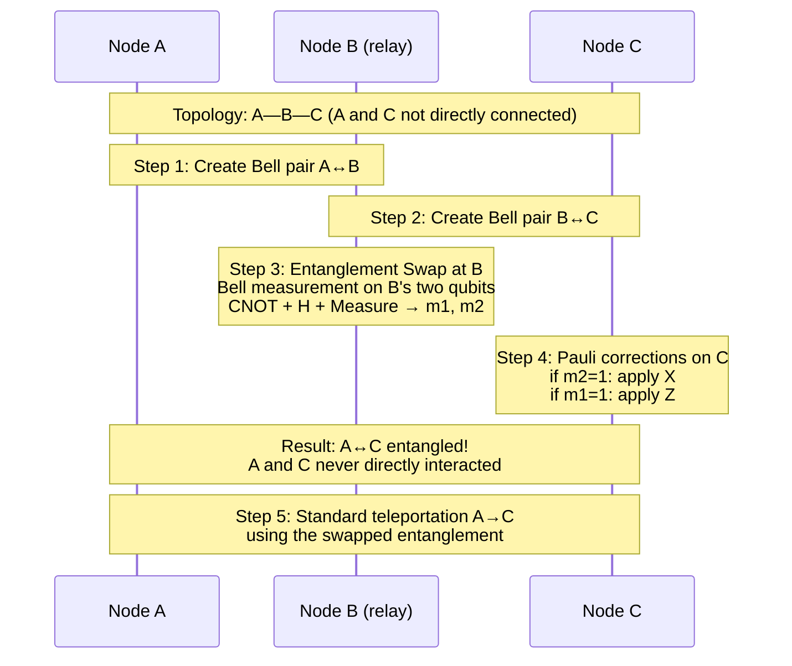
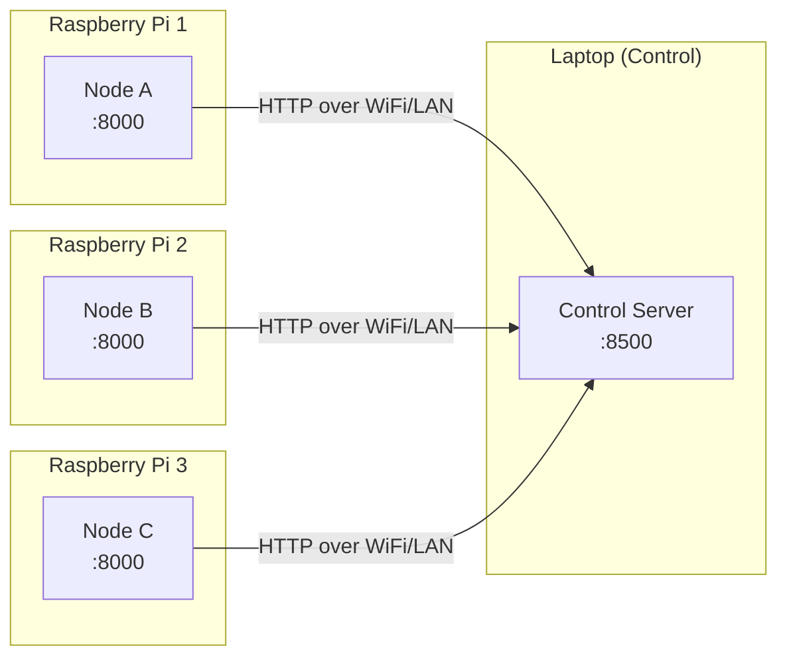

<div align="center">

# 🔮 CQNE — Campus Quantum Network Emulator

**Simulate a quantum internet on your laptop.**

Distributed quantum network emulator that runs entanglement, teleportation, and routing across nodes over real TCP/IP — powered by Qiskit's statevector simulator.

[](https://www.python.org/downloads/)
[](https://qiskit.org/)
[](https://fastapi.tiangolo.com/)
[](LICENSE)

[Quick Start](#-quick-start) · [Architecture](#-architecture) · [Features](#-features) · [Dashboard](#-dashboard) · [YAML Experiments](#-yaml-experiments) · [API](#-api-reference)

</div>

---

## ✨ Why CQNE?

Most quantum network simulators are monolithic — they run everything in one process and fake the networking. CQNE is different:

- **Truly distributed** — Each node is a separate process communicating over HTTP. Deploy on Raspberry Pis for a physical quantum network testbed.
- **Physically real entanglement** — One global Qiskit `QuantumCircuit` spans all nodes. Bell pairs are real `|Φ+⟩` states, not flags in a database.
- **Research-grade** — Decoherence decay, depolarizing/dephasing gate noise, multiple routing strategies. Study noise-resilient protocols on real topologies.

---

## 🏗 Architecture



### How the Global Statevector Works



### Multi-hop Teleportation (Entanglement Swapping)



---

## 🎯 Features

### Quantum Operations

| Feature | Description |
|---------|-------------|
| **Entanglement** | Real Bell pairs `\|Φ+⟩ = (|00⟩ + |11⟩)/√2` verified in the statevector |
| **Teleportation** | Full protocol: Bell pair → Bell measurement → Pauli corrections |
| **Multi-hop Routing** | Entanglement swapping at intermediate nodes (A→B→C) |
| **GHZ States** | N-qubit entanglement across any number of nodes |

### Noise & Decoherence

| Feature | Description |
|---------|-------------|
| **Depolarizing Noise** | Random Pauli (X/Y/Z) error after each gate with probability `p` |
| **Dephasing Noise** | Phase-flip (Z) error after each gate with probability `p` |
| **Decoherence** | Entangled pairs decay: `F(t) = F₀ × exp(-rate × t)` |
| **Configurable** | All parameters adjustable via dashboard sliders in real-time |

### Routing

| Strategy | Algorithm | Best For |
|----------|-----------|----------|
| **Shortest Path** | BFS | Minimum latency |
| **Max Fidelity** | Dijkstra on `-log(F)` | Best end-to-end fidelity |

### Platform

| Feature | Description |
|---------|-------------|
| **YAML Experiments** | Define experiment sequences in YAML, run with one click |
| **SQLite Persistence** | Results survive server restarts |
| **Live Dashboard** | Real-time topology, fidelity monitoring, experiment controls |
| **REST API** | Full Swagger documentation at `/docs` |
| **Scalable** | Deploy nodes on Raspberry Pis over LAN |

---

## 🚀 Quick Start

### Prerequisites

- Python 3.11+
- pip

### Setup

```bash
git clone https://github.com/ssmswapnil/cqne.git
cd cqne

python -m venv venv

# Windows
venv\Scripts\activate
# Linux/Mac
source venv/bin/activate

pip install -r control_server/requirements.txt
pip install -r node/requirements.txt
pip install pyyaml
```

### Run

**Terminal 1 — Control Server:**
```bash
python run_control.py
```

**Terminal 2 — Nodes:**
```bash
python run_nodes.py
```

**Open Dashboard:** [http://localhost:8500/dashboard](http://localhost:8500/dashboard)

**API Docs:** [http://localhost:8500/docs](http://localhost:8500/docs)

---

## 🖥 Dashboard

The dashboard provides full control over the quantum network:

**Left sidebar:**
- Node status (online/offline with heartbeat)
- Experiment controls (Entangle, Teleport, GHZ)
- YAML experiment runner
- Routing controls (topology, strategy)
- Noise & decoherence sliders

**Main area:**
- Live network topology with fidelity percentages on entanglement links
- Experiment history with measurements, routing info, and timing

**Features visible on the dashboard:**
- Nodes glow green when online
- Entanglement links show real-time fidelity (green → amber → red as they decay)
- Topology lines change when switching between full mesh and linear routing
- Tags indicate current mode: `Mesh`/`Linear`, `Shortest`/`Max fidelity`, `Noisy`/`Noiseless`, `SQLite`

---

## 📄 YAML Experiments

Write experiment sequences as YAML files and run them from the dashboard:

```yaml
name: "Noise comparison"
description: "Compare fidelity under different noise levels"
steps:
  # Perfect (no noise)
  - action: reset
  - action: set_noise
    gate_error: 0.0
    dephasing: 0.0
  - action: entangle
    node_a: node_a
    node_b: node_b
    repeat: 5

  # High noise
  - action: reset
  - action: set_noise
    gate_error: 0.15
    dephasing: 0.10
  - action: entangle
    node_a: node_a
    node_b: node_b
    repeat: 5
```

### Available Actions

| Action | Parameters | Description |
|--------|-----------|-------------|
| `reset` | — | Clear quantum state and entanglement links |
| `set_noise` | `gate_error`, `dephasing` | Configure gate noise (0-1) |
| `set_decoherence` | `rate` | Set fidelity decay rate |
| `set_topology` | `adjacency` | Set custom network topology |
| `set_strategy` | `strategy` | `shortest_path` or `max_fidelity` |
| `entangle` | `node_a`, `node_b`, `repeat` | Create Bell pairs |
| `teleport` | `source`, `target`, `shots`, `repeat` | Teleport qubits |
| `ghz` | `nodes`, `repeat` | Create GHZ states |
| `wait` | `seconds` | Pause (for decoherence tests) |

### Included Templates

| Template | Steps | What It Tests |
|----------|-------|---------------|
| `noise_comparison.yaml` | 9 | Fidelity at 3 noise levels |
| `routed_teleport.yaml` | 6 | Direct vs multi-hop teleportation |
| `decoherence_test.yaml` | 6 | Fidelity decay over time |
| `stress_test.yaml` | 12 | Full network with all experiment types |

---

## 📡 Multi-Machine Deployment

CQNE is designed to scale from one laptop to a physical network:



1. Edit `config.json` with your LAN IPs
2. On each Pi: `python run_node.py --node_id node_a --port 8000 --control_url http://<laptop_ip>:8500`
3. On laptop: `python run_control.py`

The code is the same — only IPs change.

---

## 📁 Project Structure

```
cqne/
├── control_server/
│   ├── control_server.py          # FastAPI app — all REST endpoints
│   ├── quantum_state_manager.py   # Global Qiskit circuit + gate noise
│   ├── entanglement_manager.py    # Bell pairs + decoherence decay
│   ├── experiment_executor.py     # Teleport, GHZ, entangle + fidelity calc
│   ├── routing_engine.py          # BFS + Dijkstra routing
│   ├── results_database.py        # SQLite persistence
│   ├── yaml_runner.py             # YAML experiment parser/executor
│   ├── node_registry.py           # Node heartbeat tracking
│   ├── static/dashboard.html      # Web dashboard
│   └── tests/                     # Unit tests
├── node/
│   └── main.py                    # Node process (register + heartbeat)
├── experiments/                   # YAML experiment templates
├── run_control.py                 # Launch control server
├── run_nodes.py                   # Launch 3 node processes
├── config.json                    # LAN IPs for multi-machine
└── check_setup.py                 # Dependency checker
```

---

## 🔌 API Reference

<details>
<summary><b>Experiments</b></summary>

| Endpoint | Method | Description |
|---|---|---|
| `/experiment/entangle` | POST | Create Bell pair between two nodes |
| `/experiment/teleport` | POST | Teleport a qubit (auto-routes if needed) |
| `/experiment/ghz` | POST | Create GHZ state across N nodes |
| `/experiment/results` | GET | All experiment results (from SQLite) |
| `/experiment/stats` | GET | Aggregate statistics |
| `/experiment/fidelity_history` | GET | Fidelity values over time |
| `/experiment/clear_history` | POST | Clear the database |

</details>

<details>
<summary><b>YAML</b></summary>

| Endpoint | Method | Description |
|---|---|---|
| `/experiment/yaml/templates` | GET | List available templates |
| `/experiment/yaml/template/{file}` | GET | Get template content |
| `/experiment/yaml/run_template/{file}` | POST | Execute a template |
| `/experiment/yaml/run` | POST | Execute YAML from request body |

</details>

<details>
<summary><b>Routing</b></summary>

| Endpoint | Method | Description |
|---|---|---|
| `/routing/set_topology` | POST | Set custom topology (adjacency list) |
| `/routing/clear_topology` | POST | Revert to full mesh |
| `/routing/find_path` | POST | Compute path between nodes |
| `/routing/set_strategy` | POST | Switch routing algorithm |

</details>

<details>
<summary><b>Noise & State</b></summary>

| Endpoint | Method | Description |
|---|---|---|
| `/noise/set` | POST | Configure gate_error and dephasing |
| `/decoherence/set_rate` | POST | Set entanglement decay rate |
| `/quantum/reset` | POST | Reset quantum state (preserves history) |
| `/quantum/statevector` | GET | Raw statevector inspection |

</details>

---

## 🛠 Tech Stack

| Component | Technology |
|-----------|-----------|
| Quantum simulation | Qiskit + Qiskit Aer |
| Network layer | FastAPI + Uvicorn |
| Node communication | httpx |
| Database | SQLite |
| Experiment definitions | PyYAML |
| Dashboard | Vanilla HTML/CSS/JS |
| Fonts | JetBrains Mono + DM Sans |

---

## 🗺 Roadmap

- [x] Global statevector (real entanglement)
- [x] Quantum teleportation protocol
- [x] Multi-hop routing with entanglement swapping
- [x] Decoherence simulation
- [x] Depolarizing + dephasing gate noise
- [x] Multiple routing strategies
- [x] YAML experiment definitions
- [x] SQLite persistent database
- [x] Live web dashboard
- [ ] Deploy on Raspberry Pi cluster
- [ ] BB84/E91 QKD protocols
- [ ] Entanglement purification
- [ ] Distributed quantum circuits
- [ ] Fidelity trend charts on dashboard
- [ ] Circuit designer UI

---

## 📜 License

MIT — use it, modify it, build on it.

---

<div align="center">

Built for the quantum internet.

**[⬆ Back to top](#-cqne--campus-quantum-network-emulator)**

</div>
